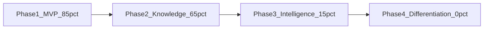
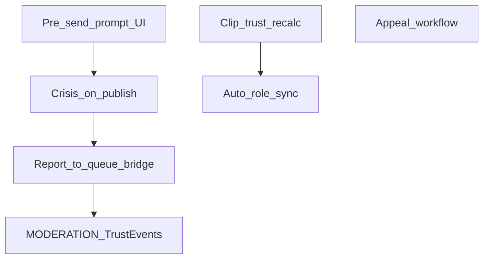

# ProSocial Application Audit — Stages 1–8

**Audit procedure:** [CompleteAudit.md](../CompleteAudit.md) §§1–8
**Design specification:** [ProsocialNetworkDesign.md](../ProsocialNetworkDesign.md)
**Application:** [prosocial_platform](../prosocial_platform)
**Date:** 2026-07-05
**Mode:** Read-only audit + prioritized remediation (Stages 5–8 fixes)

---

## Delta Log (since Stage 4 audit)

| Item | Stage 4 status | Current status |
|------|----------------|----------------|
| Test count | 62 passed | **80 passed** |
| PRIV-DELETE-01 account deletion | Not implemented | **Closed** — `accounts/services.py`, `test_account_deletion.py` |
| FLOW-D01 deleted replies in thread | Open | **Closed** — `test_reply_selectors.py`; deleted leaf replies hidden; parent-with-child retained for thread integrity |
| FLOW-D02 rate_reply block check | Open | **Partial** — reply guarded; `rate_post` still lacks block check |
| PRIV-EXPORT-01 data export | Incomplete | **Improved** — `build_export_payload` includes 15 sections (account through guild_memberships) |
| Report → moderation queue | Not verified | **Open** — confirmed gap (Stage 8 MOD-F01) |
| Crisis on publish | Not verified | **Open** — confirmed gap (Stage 8 MOD-F02) |

---

## Deliverables

| Stage | Document | Description |
|-------|----------|-------------|
| 1 | [Stage1_RequirementsBaseline.md](Stage1_RequirementsBaseline.md) | 147 requirements, classifications, 13 open design decisions, P1–P7 index |
| 2 | [Stage2_ApplicationInventory.md](Stage2_ApplicationInventory.md) | Repo topology, stack, schema, routes, integrations, tests |
| 3 | [Stage3_UserFlowCatalog.md](Stage3_UserFlowCatalog.md) | 22+ user flows traced; 10 defects; role matrix |
| 4 | [Stage4_RequirementsTraceabilityMatrix.md](Stage4_RequirementsTraceabilityMatrix.md) | Full RTM, phase completion, principles conformance |
| 5 | [Stage5_PrinciplesEvaluation.md](Stage5_PrinciplesEvaluation.md) | P1–P7 behavioral deep-dive with risk ratings |
| 6 | [Stage6_SocialKnowledgeReview.md](Stage6_SocialKnowledgeReview.md) | 22 feature areas, clipping integrity scenarios |
| 7 | [Stage7_TrustGamificationReview.md](Stage7_TrustGamificationReview.md) | Scoring mechanism matrix, gaming/ethics register |
| 8 | [Stage8_ModerationSafetyReview.md](Stage8_ModerationSafetyReview.md) | 10-step moderation lifecycle, crisis vs misconduct |

---

## Executive Summary (Stages 1–8)

### Actual maturity

The application remains **mixed-phase**: design **Phase 1 (~85%)** and **Phase 2 (~65%)** are largely present, while **Phase 3 (~15%)** and **Phase 4 (~0%)** are mostly absent. Vision-scope features (trust, gamification, AI heuristics, moderation, guilds, messaging) are implemented ahead of design Phases 3–4 but with **incomplete wiring** between subsystems.

### Strongest areas

- Auth, posts, replies, dashboard feed (Phase 1 core)
- Account deletion with grace period (new since Stage 4)
- Clips (whole post), vault, collections, follows, notifications (Phase 2 partial)
- Block/mute, reporting infrastructure, moderator queue UI
- Reply visibility with thread-integrity rules (unit tested)
- 80 passing integration/unit tests

### Most important gaps (design roadmap)

1. Passage-level clipping and basic text search (Phase 2)
2. Public collection visibility enforcement (Phase 2)
3. Report-to-moderation-queue bridge (safety foundation)
4. Crisis detection at publish time (safety foundation)
5. Thread summaries and semantic search (Phase 3)

### Most serious implementation defects (post Stage 5–8)

1. ~~Reports do not create `ModerationReview` queue items~~ — **Fixed**
2. ~~Crisis phrases not checked on post/reply create~~ — **Fixed**
3. ~~Clip TrustEvents do not trigger trust recalc~~ — **Fixed**
4. ~~Platform roles not auto-synced after trust updates~~ — **Fixed**
5. ~~Pre-send reflection prompt not wired to compose UI~~ — **Fixed**

### Remaining gaps (not in Stages 5–8 fix scope)

1. Passage clip uses simplified offsets (not DOM-relative selection indices)
2. Appeal workflow and decision notifications still absent
3. Crisis resource UI for authors not yet surfaced
4. Semantic search and LLM summaries (Phase 3)

### Test verification

```
80 passed in 2.82s (pytest tests/)
```

---

## Phase Completion at a Glance



---

## Principles Snapshot (Stage 5)

| Principle | Result | Top finding |
|-----------|--------|-------------|
| P1 Prosocial over popularity | Partial | Chronological feed; discovery ranks by clips |
| P2 Visibility as responsibility | Partial | Roles exist; not auto-synced; feed not score-weighted |
| P3 Gentle friction | Partial | Pre-send + crisis not wired to publish |
| P4 Earned privacy | Not aligned | Not implemented (defer pending review) |
| P5 Knowledge outlasts conversation | Partial | Whole-post clips work; passage/summaries missing |
| P6 Growth is the metric | Partial | XP/streak prominent; no skill KPI dashboard |
| P7 AI coach not cop | Partial | Heuristic only; no binding enforcement |

---

## Cross-Stage Dependencies



- **Moderation workflow** blocks `MODERATION_UPHELD` / `MODERATION_FRIVOLOUS` trust events (Stage 7).
- **Trust recalc + role sync** must precede further gamification expansion (Stage 4 §4.3).
- **P3 pre-send prompt** is independent but pairs with crisis detection for safety layering.

---

## Remediation Status (Stages 5–8 plan)

| Priority | Fix | Status |
|----------|-----|--------|
| Blocker | Crisis check on content create | **Done** — `posts/services.py`, `interactions/services.py` |
| Blocker | Report → moderation queue bridge | **Done** — `enqueue_moderation_review`, `submit_report` |
| Blocker | Reply visibility | **Closed** (pre-existing tests) |
| Must | Trust recalc after clip | **Done** — `knowledge/services.py` |
| Must | Auto role sync after trust recalc | **Done** — `trust/services.py` |
| Must | Block guard on rate_post | **Done** — `trust/views.py` |
| Must | Pre-send prompt in compose UI | **Done** — `ai_coach/pre_send_check`, static JS |
| Should | Collection visibility on create + public read | **Done** — `create_collection`, `get_collection_for_display` |
| Should | Basic post/tag search | **Done** — `/knowledge/search/` |
| Should | Passage clip endpoint + UI | **Done** — `clip_selection` view + static JS |

### Test verification (post-remediation)

```
92 passed in 2.81s (pytest tests/)
```

---

## Recommended Next Steps (before Stages 9–19)

1. Complete blocker and must-have fixes from remediation table above
2. Re-run full test suite and update RTM rows for closed defects
3. Proceed to Stage 9 (AI/LLM integrations audit) only after moderation pipeline is wired
4. Defer earned-privacy gating (P4) until product/legal review

---

*Stages 9–19 of CompleteAudit.md (AI audit, privacy mapping, secrets scan, accessibility, final deliverables) remain out of scope for this document.*
